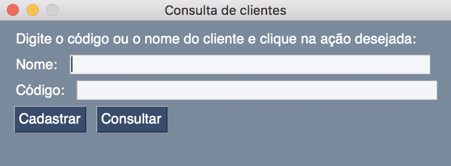

# ine5404-aula-12-out
Exemplo de um sistema de cadastro de clientes utilizando o padrão MVC (Model, View, Controller)

O sistema deve executar as seguintes funcionalidades:
 - Cadastro de novos usuários
 - Consulta de usuários cadastrados por nome ou por código
 
Implemente o código mais resistente a crashes possível e informe seu usuário quando algo inesperado ocorrer.

As telas a seguir mostram exemplos do funcionamento esperado:

